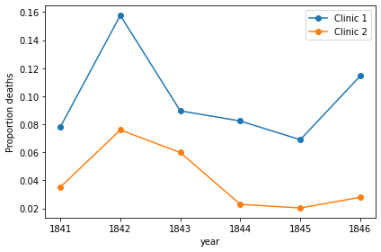

# Importance of Handwashing

## 1. Meet Dr. Ignaz Semmelweis

This is Dr. Ignaz Semmelweis, a Hungarian physician born in 1818, who worked at the Vienna General Hospital. If he looks troubled, it's likely because he’s pondering childbed fever, a deadly disease affecting women who have just given birth. During the early 1840s, the mortality rate at the hospital was alarmingly high, with up to 10% of new mothers succumbing to this illness. Semmelweis realized that the cause was the contaminated hands of doctors delivering the babies. Despite knowing this, he struggled to get his colleagues to wash their hands.

In this project, we will reexamine the data that led Semmelweis to discover the critical role of handwashing. Let's begin by exploring the data that revealed the flaws in the procedures at Vienna General Hospital.

## 2. The Alarming Number of Deaths

The table above details the number of births and deaths at the two clinics within the Vienna General Hospital between 1841 and 1846. Childbirth was perilously dangerous, with a significant number of women dying, primarily from childbed fever.

We can better understand this by looking at the proportion of deaths relative to the number of births. Let's focus on Clinic 1's death rate.

)

## 4. The Handwashing Begins

Why was the death rate so much higher in Clinic 1? Semmelweis observed this troubling trend and was deeply concerned. The key difference between the clinics was that Clinic 1 had many medical students, while Clinic 2 primarily had midwife students. The medical students often handled corpses in the autopsy rooms before assisting with childbirth, unlike the midwives who only attended to the mothers.

Semmelweis suspected that something from the corpses was being transferred via the medical students' hands, causing childbed fever. In a bold move to combat this, he mandated handwashing—a radical and controversial idea at the time, as the concept of bacteria was unknown.

Let’s look at the monthly data from Clinic 1 to see the impact of this new practice.

## 5. The Effect of Handwashing

With the data loaded, we can observe the death rates over time. Although the exact point where handwashing became mandatory isn’t marked, the drastic reduction in death rates should be evident.

## 6. The Effect of Handwashing Highlighted

From the summer of 1847, the death rate dropped significantly, coinciding with when Semmelweis enforced handwashing.

This change becomes even clearer when highlighted in the graph.

## 7. More Handwashing, Fewer Deaths?

Once again, the graph underscores the significant impact of handwashing. But exactly how much did it reduce the monthly death rate on average?

## 8. A Bootstrap Analysis of Semmelweis’ Handwashing Data

Handwashing decreased the death rate by approximately 8 percentage points, from an average of 10% to just 2% (still high by modern standards).

To understand the uncertainty around this reduction, we can calculate a confidence interval using the bootstrap method.

## 9. The Fate of Dr. Semmelweis

Handwashing reduced the death rate by between 6.7 and 10 percentage points, based on a 95% confidence interval. Semmelweis had compelling evidence that a simple procedure like handwashing could save countless lives.

Tragically, despite his findings, Semmelweis’ theory—that childbed fever was caused by a substance from corpses (what we now know as bacteria)—was mocked by his contemporaries. The medical community largely dismissed his discovery, and in 1849, he was forced to leave Vienna General Hospital.

One reason for this rejection was the lack of familiarity with statistics in the 1800s medical field. Semmelweis presented his data as raw tables without graphs or confidence intervals. If he had access to the analyses we've performed here, he might have been more successful in convincing the doctors in Vienna to adopt handwashing.
