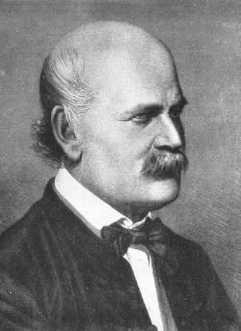

# Importance of Handwashing

## 1. Meet Dr. Ignaz Semmelweis

Dr. Ignaz Semmelweis, born in 1818 in Hungary, worked at the Vienna General Hospital. If he appears troubled in his portrait, it’s because he was deeply concerned about childbed fever, a deadly infection affecting new mothers. In the early 1840s, this illness claimed the lives of up to 10% of women who gave birth at the hospital. Semmelweis discovered that the disease was spread by doctors' unwashed hands, but he struggled to convince his colleagues to adopt handwashing.

In this project, we'll reanalyze the data that led Semmelweis to his crucial discovery about the significance of hand hygiene. Let’s begin by examining the data that revealed the problem at the Vienna General Hospital.

## 2. The Alarming Number of Deaths

The table above lists the number of births and deaths at two clinics in the Vienna General Hospital from 1841 to 1846. Childbirth was perilous during this time, with many women dying from childbed fever.

To understand this better, let’s look at the proportion of deaths among the women who gave birth, focusing on Clinic 1.

## 3. Death at the Clinics

If we now plot the proportion of deaths at both Clinic 1 and Clinic 2  we'll see a curious pattern…

## 4. The Handwashing Begins

Why was the death rate consistently higher in Clinic 1? Semmelweis noticed this and was alarmed. The key difference between the clinics was that Clinic 1 had many medical students, while Clinic 2 had mostly midwife students. The medical students often went from autopsy rooms to the maternity ward without washing their hands, unlike the midwives who only attended to births.

Suspecting that something from the corpses was being transmitted by the medical students, Semmelweis instituted a handwashing policy. This was a radical idea at the time, as the existence of bacteria was not yet known.

Let's examine the monthly data from Clinic 1 to see if handwashing made a difference.

## 5. The Effect of Handwashing

With the data in hand, we can track the death rates over time. Although we haven’t marked the exact moment handwashing was implemented, the significant drop in death rates should be apparent.

## 6. The Effect of Handwashing Highlighted

Starting in the summer of 1847, the death rate dropped sharply—this was when Semmelweis mandated handwashing.

This dramatic change is even clearer when highlighted in the graph.

## 7. More Handwashing, Fewer Deaths?

The graph clearly shows that handwashing had a significant impact. But how much did it reduce the monthly death rate on average?

## 8. A Bootstrap Analysis of Semmelweis’ Handwashing Data

Handwashing brought down the death rate by about 8 percentage points, from an average of 10% to just 2%, which is still high by today's standards.

To better understand the uncertainty around this reduction, we can calculate a confidence interval using the bootstrap method.

## 9. The Fate of Dr. Semmelweis

Handwashing reduced the death rate by between 6.7 and 10 percentage points, based on a 95% confidence interval. Semmelweis had robust evidence that handwashing was a simple yet highly effective life-saving measure.

Sadly, despite his compelling findings, Semmelweis’ theory—that childbed fever was caused by a substance from corpses (what we now know as bacteria)—was dismissed by his peers. The medical community largely ignored his discovery, and in 1849, he was forced to leave the Vienna General Hospital.

One reason for this dismissal was the limited use of statistics in medicine at the time. Semmelweis presented his data as raw tables without graphs or confidence intervals. If he had the analytical tools we have used here, he might have been more successful in convincing the medical community of the importance of handwashing.